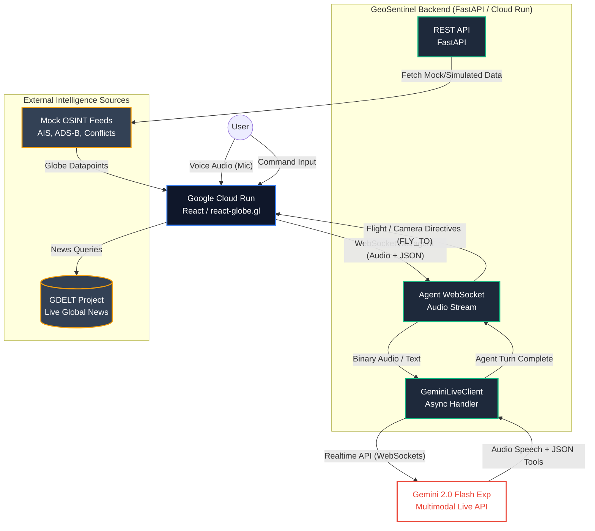

# Architecture Diagram: GeoSentinel

This Mermaid diagram illustrates the system architecture of GeoSentinel, demonstrating how the React frontend interacts with the Python backend, Gemini Live API, and external intelligence sources.

